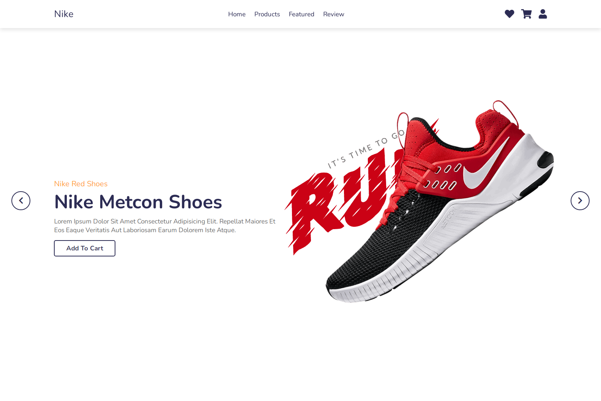

# ecommerce website
> Started at:  May 25, 2022

## Project Description

This is a landing page for an e-commerce website designed to showcase a mock project for a custom Nike shoe store. The goal of this project is to create a visually appealing and responsive landing page that highlights the concept of modern custom-designed Nike shoes. The page includes interactive elements and modern UI/UX design principles.

## Table of contents

-   [Overview](#overview)
    -   [Screenshot](#screenshot)
    -   [Links](#links)
-   [My process](#my-process)
    -   [Built with](#built-with)
    -   [What I learned](#what-i-learned)
    -   [Continued development](#continued-development)
-   [Author](#author)


### Screenshot



### Links

-   Icon website: [fontawesome](https://fontawesome.com/)
-   Live Site URL: [link](https://ymhaah.github.io/TRAIN_ecommerce-website/)

## My process

I focused on using the Animation that appears with the open of the page on this site and I used this site as an example on a ecommerce website

### Built with

-   Semantic HTML5 markup
-   CSS custom properties
-   Flexbox
-   CSS Grid
-   animation
-   Mobile-first workflow

### What I learned

```html
<meta name="color-scheme" content="dark light" />
<section aria-labelledby="Introduction to page"></section>

<p>copy right &copy;</p>
```

```css
img {
	transform: rotateY(180deg) rotate(300deg);
	filter: drop-shadow(0 20px 15px rgba(10, 10, 10, 0.9)) brightness(90%)
		contrast(110%) grayscale(10%);
}
h3 {
	writing-mode: vertical-rl;
}
p {
	font-size: calc(2rem + 1vw);
}
```

```js
let options = {
	root: null,
	threshold: 0,
	rootMargin: "",
};
let observer = new IntersectionObserver(function (entries, observer) {
	entries.forEach(function (entry) {
		if (entry.isIntersecting) {
			turnBrowne.classList.add("turn-browne");
		} else {
			turnBrowne.classList.remove("turn-browne");
		}
	});
}, options);
```

### Continued development

-   html seo
-   css animation
-   js observer

### Useful resources

Check out my latest previous articles:

-   [how to make an Indestructible button?](https://dev.to/ymhaah/how-to-make-an-indestructible-button-3f2h)
-   [Top 5 Icon websites for devs and designers!!!](https://dev.to/ymhaah/top-5-icon-websites-for-devs-and-designers-53mh)
-   [30-Day React Learning Journey!](https://dev.to/ymhaah/series/20473)

## Author

-   professional links:
    -   [Twitter](https://twitter.com/hafanwi)
    -   [LinkedIn](https://www.linkedin.com/in/youssef-hafnawy/)
    -   [GitHub](https://github.com/ymhaah)
-   Hire me:
    -   [UpWork](https://www.upwork.com/services/product/development-it-a-custom-and-responsive-websites-in-wordpress-1577236892828233728?ref=project_share)
    -   [Freelancer](https://freelancer.com/u/ymhaah)
-   Blog:
    -   [HashNode](https://hafnawi.hashnode.dev/)
    -   [Dev.to](https://dev.to/ymhaah)
    -   [Medium](https://medium.com/@ymhaah250)
